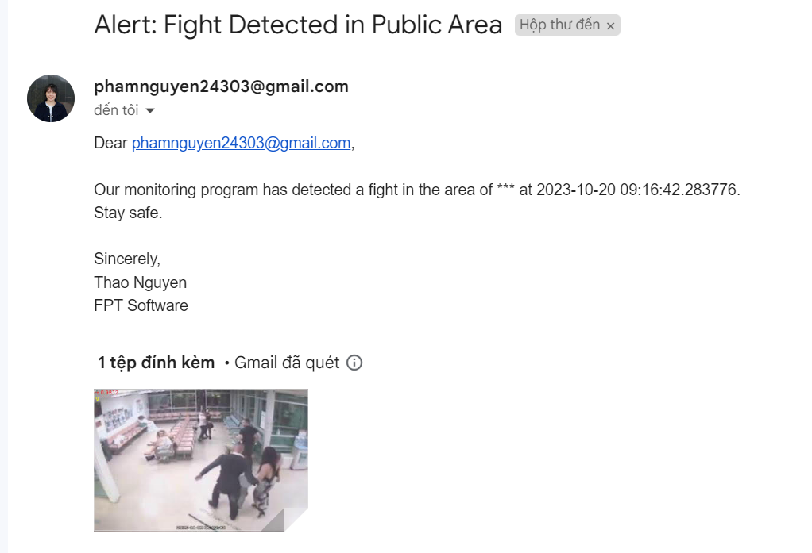

# Fight Detection using 3D CNNs
## Introduction
This project applies a 3D Convolutional Neural network to detect fighting in surveillance cameras implemented using PyTorch. The data set is compiled from many sources on the internet.
Re-implement the C3D model for the custom dataset 2 layers described in the repo: [pytorch-video-recognition](https://github.com/jfzhang95/pytorch-video-recognition)

## Table of Contents

- [Installation](#installation)
- [Usage](#usage)
- [Webapp](#Webapp)
- [License](#license)

## Installation
Anaconda and Python 3.8. After installing the Anaconda environment:

0. Clone the repo:
    ```Shell
    git clone https://github.com/Thaonguyennnee/Violence-Detection-using-3D-Convolutional-Neural-Networks.git
    ```

1. Install dependencies:

    For PyTorch dependency, see [pytorch.org](https://pytorch.org/) for more details.

2. Install Project Dependencies:
    ```Shell
    pip install -r requirements.txt
    ```

## Usage

1. Configure your dataset and pre-trained model path in
[mypath.py](mypath.py).

2. Testing:

    To test the model, please do:
    ```Shell
    python inference.py
    ```
    
3. Training:
   To test the model, please do:
    ```Shell
    python train.py
    ```

## Webapp
```Shell
python app.py
```
<div align="center">
    <a href="./">
        
    </a>
    <a href="./">
        
    </a>
</div>


